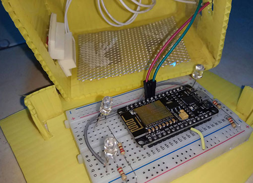
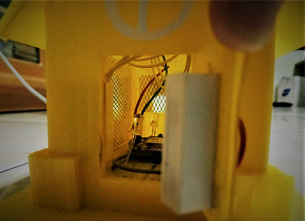
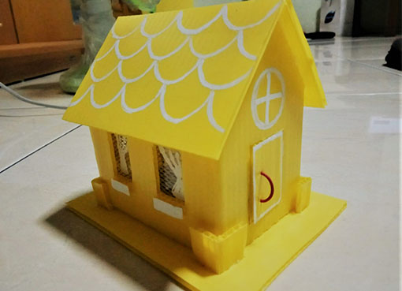

# Door Sensor Project
by : Iot Squad
 

#### Table of Contents
* [Team Members](#team-members)
* [Background Project](#background-project)
* [How the tool works](#tool-works)
* [Required Equipment](#required-equipment)
* [Schematics](#schematics)
* [Source Code](#source-code)
* [Images](#images)
* [Project Demo](#project-demo)
* [Conclution and Suggestion](#conclution-suggestion)

#### Team Members
---

- Cindy Tania 
- Nandini
- Hade Morray

#### Background Project
---

This happens in every big city, most our daily activities we do outside the home.  In the working time, there has a lot of empty houses that has been left by their owner. Moreover for the holiday season like Eid, Christmas, or New Year. The empty house is an easy target for thieves, especially homes without adequate security systems. 

Many modes are performed by thieves to carry out the action. Starting from knocking the door of the house, pretend to ask the address. If there is no answer and is sure the house is empty, they will immediately disassemble the door of the house and take the valuables things. In addition there are also pretend as PLN officers, cable network technicians or monitoring cameras (CCTV), garden rearrangers, gas stove inspectors, and various other modes. As the crime of crime or theft that can occur in the surrounding environment. For example the theft of a house that rife in our country. Thieves who often steal homeowners' valuables by breaking into the house and often damaging locks on doors.

With the door security system that we made, automatically the door can be monitored from anywhere by using internet data as its network connection. With the Internet of Things (IoT) system can monitoring the door in a realtime. The project basically demonstrates sending a message to our phone (throught LINE also Telegram). If a change is detected in a couple of door sensors. At present the project is only in the testing phase but it should give you an understanding on connecting it up ready for installation.

Besides sending a message, this IoT can also turn off and turn on the lights automatically.
 

#### How the tool works
---
Reed switch using GPIO 5 pin on esp8266. The esp8266 tool will connect with the access point device to connect to the internet network by entering our SSID and WIFI password. API KEY provided by IFTTT that is used to connect the device esp8266 with smartphones through LINE and Telegram applications.

Reed Switch sensor works in a very simple way, if the surface of the sensor exposed to the magnetic field then the two contacts thin plate contained inside the sensor will be attracted by the magnetic field, so the contact will be connected. The magnetic field which is moved the reed switch derived from the piston contained inside the cylinder drive, which moves up and down, that movement is detected by the reed switch.
 

#### Required Equipment
---
- ESP-12E module
- USB Cable
- 4 leds
- 4 resistor (220Ω)
- Wires
- Reed switch
- power
- IFTTT
- Arduino IDE

#### Source code
---

	#include <ESP8266WiFi.h>

	const char* ssid = "changeyourwifi";
	const char* password = "yourpasswordhere";
	const char* host = "maker.ifttt.com";
	const char* apiKey = "xxxxxxxxxxxxxxxxxxxxxxxxxxxxxxxxxxxxxxxxxxxxxxxx";

	#define pin 14
	volatile byte state = LOW;
	volatile int flag = false;
	const char* door_state;
	unsigned long previousMillis = 0; 
	const long interval = 3000;

	void changeDoorStatus() {

    	unsigned long currentMillis = millis();
 
    	if(currentMillis - previousMillis >= interval) {
        	previousMillis = currentMillis;   

    state = !state;
        	if(state) {
        	    door_state = "opened";
        	     Serial.println(door_state);   
        	     pinMode(D1, OUTPUT);
        	     analogWrite(D1, 255);
        	     pinMode(D2, OUTPUT);
        	     analogWrite(D2, 255);
        	     pinMode(D3, OUTPUT);
        	     analogWrite(D3, 255);
        	     pinMode(D4, OUTPUT);
        	     analogWrite(D4, 255);
        	}
        	else{
             	door_state = "closed";
             	Serial.println(door_state);
             	ESP.restart();
        	}
    	}
    }   
    
    void setup() {
    	Serial.begin(115200);
    	delay(100);
    	Serial.println("Preparing the Door Status Monitor project...");
     
    	pinMode(pin, INPUT_PULLUP);
    	attachInterrupt(pin, changeDoorStatus, RISING);
    	Serial.println();
    	Serial.println();
    	Serial.print("Connecting to ");
    	Serial.println(ssid);
    
    	WiFi.begin(ssid, password);
    
    	while (WiFi.status() != WL_CONNECTED) {
      		delay(500);
     		 Serial.print(".");
    	}
  
    	Serial.println("");
    	Serial.println("WiFi connected");  
    	Serial.println("IP address: ");
    	Serial.println(WiFi.localIP());  
		}

    void loop() { 
      
      if(flag = true ){

          Serial.print("connecting to ");
          Serial.println(host);
          
          WiFiClient client;
          const int httpPort = 80;
          if (!client.connect(host, httpPort)) {
            Serial.println("connection failed");
            return;
          }
    
          	String url = "/trigger/door_status/with/key/";
          	url += apiKey;
          
          	Serial.print("Requesting URL: ");
          	Serial.println(url);
          	client.print(String("POST ") + url + " HTTP/1.1\r\n" +
                       "Host: " + host + "\r\n" + 
                       "Content-Type: application/x-www-form-urlencoded\r\n" + 
                       "Content-Length: 13\r\n\r\n" +
                       "value1=" + door_state + "\r\n");
          	flag = false;
      	}  
      delay(5000);
	}

#### Images
---

 

#### Project Demo
---

 

#### Conclution and Suggestion
---
Conclution	:  
From the test results and analysis design of home door security system based IoT with esp8266 equipped it can be concluded as follows:  
1. Tool can automatically sent notification through LINE and Telegram when door open.   
2. Failure command or notification often due to network slow internet.  
3. When the door opened, the lights in the house will be on.  
 

Suggestion	:  
Tools still require refinement, as it is given some suggestions as follows: 
1. This tool can still be developed from the design side as well components be used.  
2. Can be developed at the stage implementation with using more doors and lights  
3. Can add battery for the power.  
4. This project aloso can be apply in the drawer, refrigerator, and others door too. Not only in the house door only. 